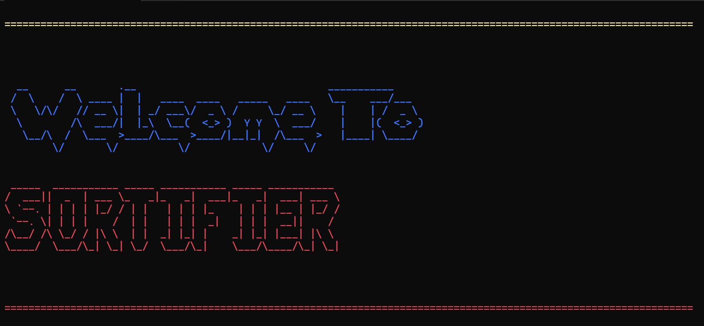

# Sort Visualizer

An interactive visualizer for sorting algorithms, built with C++ and SFML. This project provides a graphical representation of sorting algorithms, showcasing their step-by-step behavior and efficiency.

## Features
- Visualizes popular sorting algorithms:
  - Bubble Sort
  - Selection Sort
  - Insertion Sort
  - Merge Sort
  - Quick Sort
  - Heap Sort
  - count sort
  - radix sort
  - shell sort
  - oddeven sort
- Customizable array sizes and speeds for visualization.
- Real-time updates of sorting progress with animations.
- Simple and intuitive UI powered by SFML.
## Screenshots

## different shots


## Requirements
- C++ Compiler (supports C++11 or newer)
- [SFML](https://www.sfml-dev.org/) (Simple and Fast Multimedia Library)

## Installation and Setup
1. Clone the repository:
   ```bash
   git clone https://github.com/your-username/sort-visualizer.git
   cd sort-visualizer
