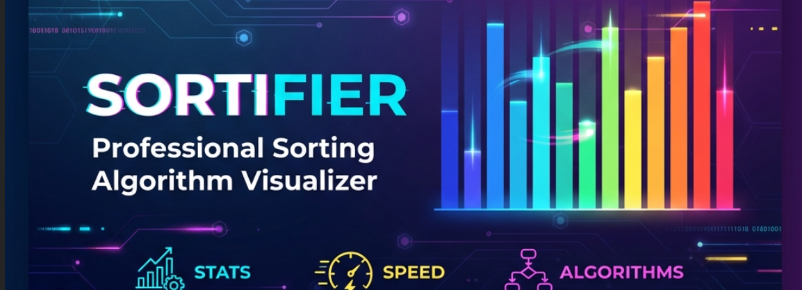
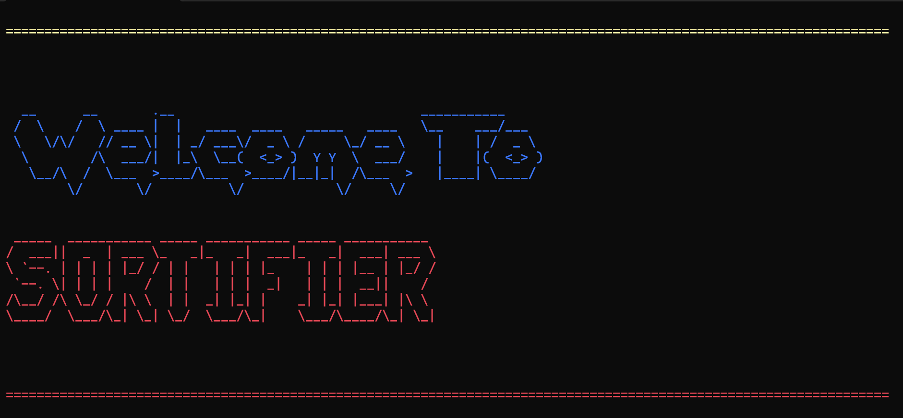
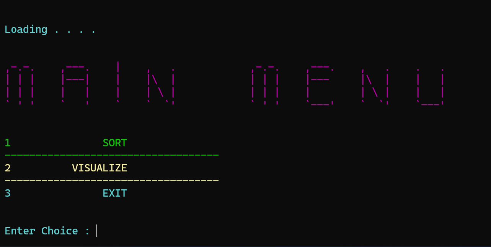
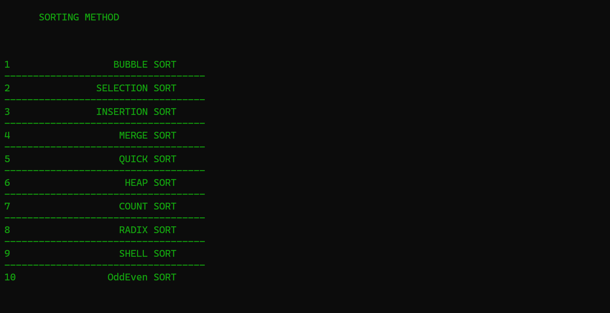
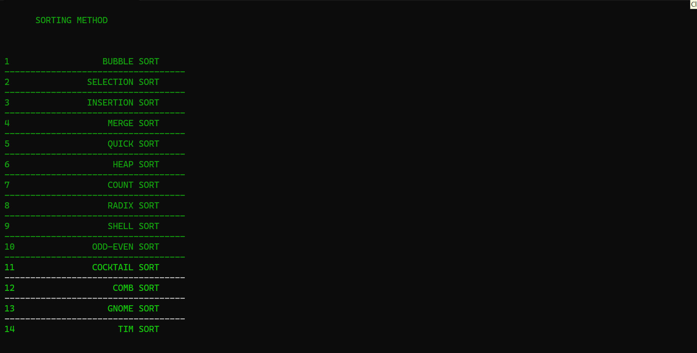
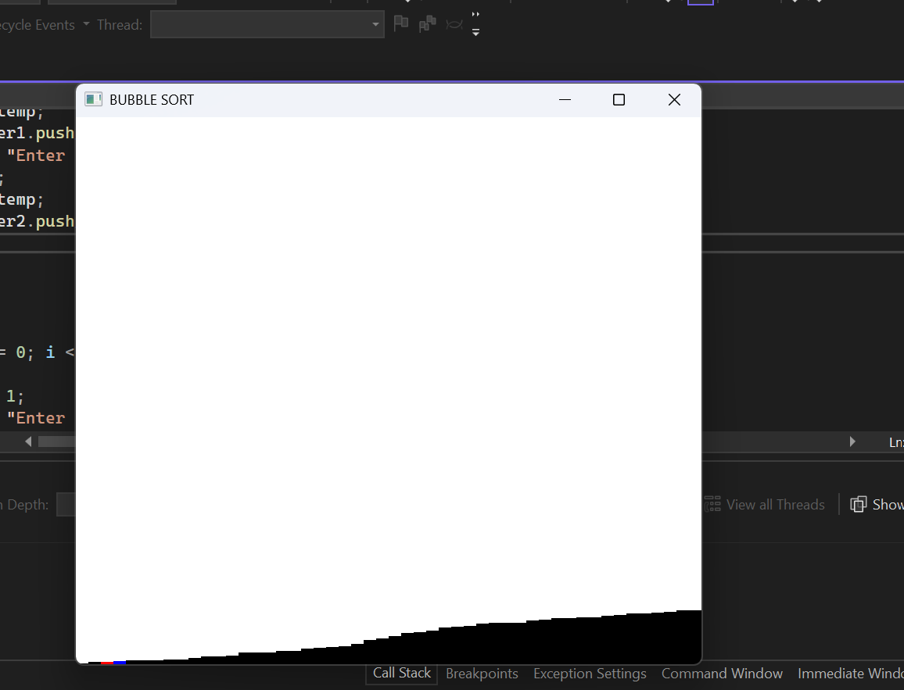

# 🎨 Sortifier - Professional Sorting Algorithm Visualizer

<div align="center">




**A stunning, professional-grade visualization tool for 14 different sorting algorithms with real-time statistics, gradient graphics, and pitch-based audio feedback.**

[📥 Download Latest Release](https://github.com/goyalkartik773/SORT_VISUALIZER/releases/tag/sortifier-v1.0) • [📸 View Screenshots](#-screenshots) • [🎬 Watch Demo](#-demo-video) • [🐛 Report Bug](https://github.com/goyalkartik773/SORT_VISUALIZER/issues)

</div>

---

## 🎬 Demo Video

<div align="center">

### Watch Sortifier in Action!


*See the beautiful visualizations, real-time statistics, and smooth animations in action!*

**Or download the video:** [sorting_window.mp4](video/sorting_window.mp4)

</div>

---

## 📸 Screenshots

<div align="center">

### Welcome Screen

*Animated welcome screen with ASCII art*

### Main Menu

*Clean and intuitive main menu interface*

### Algorithm Selection

*Choose from 14 different sorting algorithms*

### Configuration Options

*Customize array size, range, and visualization speed*

### Sorting in Action

*Beautiful gradient visualization with real-time statistics and progress tracking*

</div>

---

## ✨ Features

### 🎯 14 Sorting Algorithms

<table>
<tr>
<td>

**Classic Algorithms**
- 🔵 Bubble Sort
- 🟢 Selection Sort
- 🟡 Insertion Sort
- 🔴 Merge Sort
- 🟣 Quick Sort
- 🟠 Heap Sort

</td>
<td>

**Advanced Algorithms**
- ⚫ Count Sort
- ⚪ Radix Sort
- 🟤 Shell Sort
- 🔷 Odd-Even Sort

</td>
<td>

**Modern Algorithms** 🆕
- 🌟 Cocktail Sort
- ✨ Comb Sort
- 💫 Gnome Sort
- 🚀 Tim Sort

</td>
</tr>
</table>

### 🎨 Professional Graphics

- **1200x800 HD Window** with gradient background
- **Rainbow gradient bars** based on value height
- **Shadow effects** for depth and 3D appearance
- **Glow effects** on comparing elements (red/blue)
- **3D highlights** on bar tops for glossy look
- **Progress bar** showing sorting completion
- **300px Statistics Panel** with real-time data

### 📊 Real-Time Statistics

Track algorithm performance live:
- ⚡ **Comparisons** - Total comparison operations
- 🔄 **Swaps** - Number of element swaps
- 📈 **Array Accesses** - Memory access count
- ⏱️ **Elapsed Time** - Real-time execution time
- 📏 **Array Info** - Size and maximum value
- 🎚️ **Speed Control** - Adjustable visualization speed

### 🎵 Enhanced Audio

- **Pitch-based tones** - Higher values produce higher pitch
- **Musical feedback** - 200-1000 Hz range for pleasant sounds
- **Fast, non-intrusive** - 5ms beeps for smooth experience
- **Value-responsive** - Each swap plays a tone matching element value

---

## 🚀 Quick Start

### Installation

1. **Download** the latest release: [Sortifier_v1.0.zip](https://github.com/goyalkartik773/SORT_VISUALIZER/releases/tag/sortifier-v1.0)
2. **Extract** the ZIP file to any folder
3. **Run** `SORT_VISUALIZER.exe`

### Usage

1. Launch the application
2. Choose **option 2** (VISUALIZE)
3. Select an algorithm (1-14)
4. Configure settings:
   - **Elements:** 100-200 (recommended)
   - **Range:** 100-400 (recommended)
   - **Speed:** 10ms (recommended)
5. Watch the beautiful visualization!

---

## 🖥️ System Requirements

| Component | Minimum | Recommended |
|-----------|---------|-------------|
| **OS** | Windows 7 | Windows 10/11 |
| **RAM** | 512 MB | 2 GB |
| **Graphics** | Any GPU with OpenGL | Dedicated GPU |
| **Storage** | 50 MB | 100 MB |
| **Display** | 1280x720 | 1920x1080 |

---

## 📚 Algorithm Complexity

| Algorithm | Best | Average | Worst | Space | Stable |
|-----------|------|---------|-------|-------|--------|
| Bubble Sort | O(n) | O(n²) | O(n²) | O(1) | ✅ |
| Selection Sort | O(n²) | O(n²) | O(n²) | O(1) | ❌ |
| Insertion Sort | O(n) | O(n²) | O(n²) | O(1) | ✅ |
| Merge Sort | O(n log n) | O(n log n) | O(n log n) | O(n) | ✅ |
| Quick Sort | O(n log n) | O(n log n) | O(n²) | O(log n) | ❌ |
| Heap Sort | O(n log n) | O(n log n) | O(n log n) | O(1) | ❌ |
| Count Sort | O(n+k) | O(n+k) | O(n+k) | O(k) | ✅ |
| Radix Sort | O(nk) | O(nk) | O(nk) | O(n+k) | ✅ |
| Shell Sort | O(n log n) | O(n^1.5) | O(n²) | O(1) | ❌ |
| Odd-Even Sort | O(n) | O(n²) | O(n²) | O(1) | ✅ |
| Cocktail Sort | O(n) | O(n²) | O(n²) | O(1) | ✅ |
| Comb Sort | O(n log n) | O(n²/2^p) | O(n²) | O(1) | ❌ |
| Gnome Sort | O(n) | O(n²) | O(n²) | O(1) | ✅ |
| Tim Sort | O(n) | O(n log n) | O(n log n) | O(n) | ✅ |

---

## 🎓 Educational Value

Perfect for:

- 📚 **Learning** - Visual understanding of sorting algorithms
- 📊 **Comparing** - See efficiency differences in real-time
- ⏱️ **Understanding** - Grasp time complexity concepts
- 👨‍🏫 **Teaching** - Demonstrate algorithms to students
- 🎨 **Appreciating** - Enjoy the beauty of algorithm design

---

## 🛠️ Building from Source

### Prerequisites

- Visual Studio 2019 or later
- SFML 2.5+ library
- C++11 or newer compiler

### Build Steps

```bash
# Clone the repository
git clone https://github.com/goyalkartik773/SORT_VISUALIZER.git
cd SORT_VISUALIZER

# Open in Visual Studio
start SORT_VISUALIZER.sln

# Build
# Press Ctrl+Shift+B or Build → Build Solution

# Run
# Press F5 or Debug → Start Debugging
```

### SFML Setup

1. Download SFML 2.5.1 from [SFML website](https://www.sfml-dev.org/download.php)
2. Extract to `C:\SFML\`
3. Configure project properties:
   - Include directories: `C:\SFML\include`
   - Library directories: `C:\SFML\lib`
   - Additional dependencies: `sfml-graphics.lib`, `sfml-window.lib`, `sfml-system.lib`, `sfml-audio.lib`

---

## 🎨 Features Breakdown

### Visual Effects

- **Gradient Background** - Smooth dark theme with color transitions
- **Rainbow Bars** - HSV-based color gradient (blue → red)
- **Shadow Effects** - 3px offset shadows for depth
- **Glow Effects** - Semi-transparent halos on active elements
- **3D Highlights** - Top highlights for glossy appearance
- **Progress Indicator** - Bottom bar showing completion percentage

### User Interface

- **Statistics Panel** - 300px dedicated panel with real-time metrics
- **Text Shadows** - Improved readability on all text
- **Decorative Elements** - Accent lines and borders
- **Color Coding** - Intuitive color scheme for different states
- **Smooth Animations** - GPU-accelerated rendering at 60 FPS

### Audio Feedback

- **Pitch Variation** - Frequency range: 200-1000 Hz
- **Value Mapping** - Higher values = higher pitch
- **Short Duration** - 5ms beeps for non-intrusive experience
- **Musical Quality** - Pleasant tones instead of harsh beeps

---

## 🤝 Contributing

Contributions are welcome! Here's how you can help:

1. **Fork** the repository
2. **Create** a feature branch (`git checkout -b feature/AmazingFeature`)
3. **Commit** your changes (`git commit -m 'Add some AmazingFeature'`)
4. **Push** to the branch (`git push origin feature/AmazingFeature`)
5. **Open** a Pull Request

### Ideas for Contribution

- 🆕 Add new sorting algorithms
- 🎨 Improve visual effects
- 🎵 Enhance audio feedback
- 📝 Improve documentation
- 🐛 Fix bugs
- ⚡ Optimize performance

---

## 📝 License

This project is licensed under the MIT License - see the [LICENSE](LICENSE) file for details.

---

## 🙏 Acknowledgments

- **SFML** - Simple and Fast Multimedia Library
- **C++ Community** - For excellent resources and support
- **Algorithm Designers** - For these brilliant sorting methods
- **Open Source Community** - For inspiration and tools

---

## 📞 Support

- 🐛 **Bug Reports:** [Open an issue](https://github.com/goyalkartik773/SORT_VISUALIZER/issues)
- 💡 **Feature Requests:** [Request a feature](https://github.com/goyalkartik773/SORT_VISUALIZER/issues)
- 💬 **Discussions:** [GitHub Discussions](https://github.com/goyalkartik773/SORT_VISUALIZER/discussions)

---

## 🎯 Roadmap

### Version 1.0 ✅
- [x] 14 sorting algorithms
- [x] Professional gradient graphics
- [x] Real-time statistics tracking
- [x] Pitch-based audio feedback
- [x] Shadow and glow effects
- [x] Progress indicator

### Future Versions 🚀
- [ ] Custom font support
- [ ] Pause/Resume functionality
- [ ] Speed control with arrow keys
- [ ] Sound toggle option
- [ ] Algorithm complexity display
- [ ] Side-by-side comparison mode
- [ ] Export as video/GIF
- [ ] Custom color themes
- [ ] Array input from file
- [ ] Benchmark mode

---

## ⭐ Star History

If you find this project useful, please consider giving it a star! ⭐

---

<div align="center">

**Made with ❤️ using C++ and SFML**

*Enjoy visualizing the beauty of algorithms!* 🎨✨

[⬆ Back to Top](#-sortifier---professional-sorting-algorithm-visualizer)

</div>
